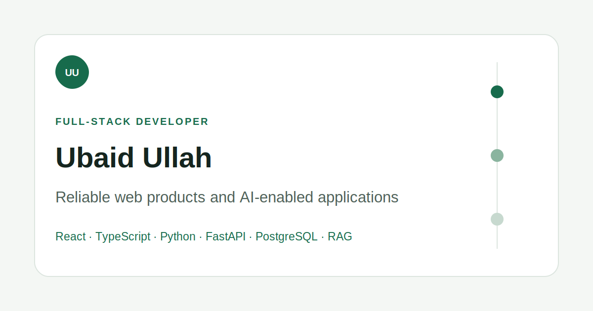

# Full-Stack Developer Portfolio

A responsive portfolio and case-study site presenting Ubaid Ullah’s full-stack product work across modern web interfaces, backend APIs, database workflows, and practical AI applications.



## Purpose

The portfolio positions Ubaid as a Full-Stack Developer working with React, TypeScript, Next.js, Python, FastAPI, PostgreSQL, REST APIs, and applied AI workflows. Project claims are intentionally separated into implemented work, current limitations, and possible improvements.

## Main Sections

- Editorial hero with a custom identity and original portrait
- Four selected projects with project-specific artwork
- Reusable, detailed case-study pages
- Professional experience
- Technical capabilities
- About and Contact sections

## Technology Stack

- React 18
- React Router 6
- JavaScript
- Custom responsive CSS
- Create React App / React Scripts
- Jest and Testing Library
- Vercel static deployment configuration

## Selected Project Notes

- The Adaptive AI Learning Companion links to its public, sanitised source repository and describes semantic verification without presenting the current implementation as complete RAG.
- The BitNorm job-board case study is anonymised and excludes private code, internal URLs, customer information, and confidential architecture.
- The e-commerce project is identified as an adaptation; its README documents the original source and verified maintenance work.
- The AI Link Summarizer is identified as an adaptation; its README preserves attribution and documents its server-side credential fix.
- No live-demo links are promoted unless the complete production workflow is verified.

## Local Setup

Prerequisites: Node.js and npm.

```bash
git clone https://github.com/ubaidullah-ctrl/developer-portfolio.git
cd developer-portfolio
npm install
npm start
```

Open `http://localhost:3000`.

## Quality Commands

```bash
npm test -- --watchAll=false
npx --no-install eslint src --ext .js,.jsx
npm run build
```

The portfolio uses JavaScript, so there is no separate TypeScript type-check command.

## Production Build and Deployment

```bash
npm run build
```

Vercel is configured to serve the generated `build` directory. `public/_redirects` preserves client-side routes on compatible static hosts.

Live portfolio: [Portfolio Website](https://my-portfolio-website-plum-theta.vercel.app/)

## Environment Variables

The portfolio has no runtime secrets or application-specific environment variables. `.env.production` only provides the legacy Node/OpenSSL compatibility option required by React Scripts 4.

## Accessibility

- Semantic heading structure and landmarks
- Keyboard-accessible responsive navigation
- Skip link and visible focus styles
- Descriptive image alternative text
- Reduced-motion support
- Sufficient colour contrast and responsive layouts
- Stable image dimensions to reduce layout shift

## Current Limitations

- The project uses the legacy React Scripts 4 toolchain and should eventually migrate through a separately reviewed upgrade.
- The anonymised job-board case study deliberately uses original editorial interface artwork rather than confidential product screenshots.
- The CV download remains removed until the technical wording is aligned with the public evidence.

## License

See [LICENSE](./LICENSE).
